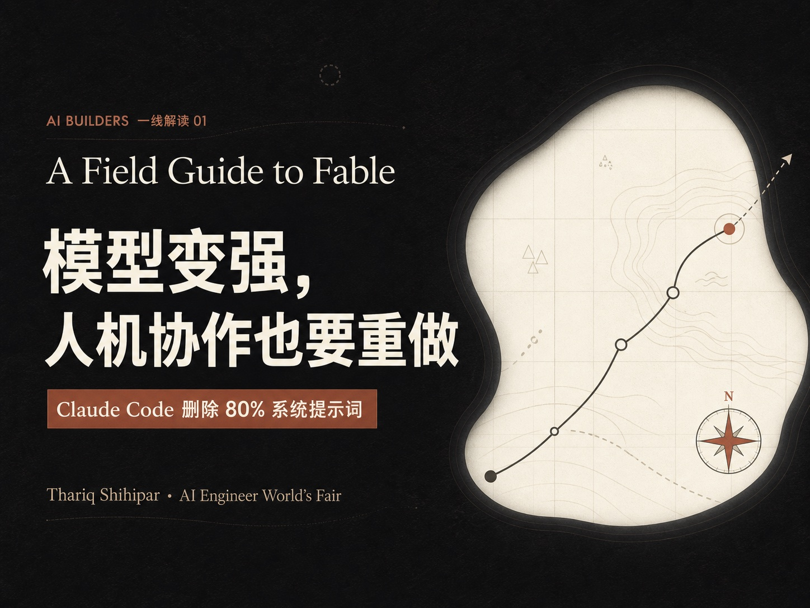
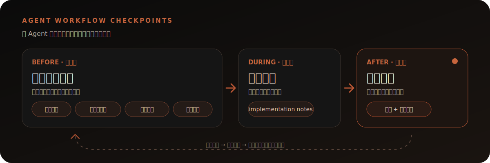

<div align="center">

<sub>AI BUILDERS 解读 · TOOLKIT 01 · A FIELD GUIDE TO FABLE</sub>

# 让 Agent 执行，让人保留关键判断

**基于 Thariq Shihipar 一线分享整理的六组 Agent 协作方法：执行前找未知，执行中留记录，完成后确认人仍在循环中。**

<a href="https://www.youtube.com/watch?v=9fubhllmsBU">
  
</a>

<p>
  <a href="toolkits/fable-agent-workflow-prompts.md"><strong>打开六组方法</strong></a>
  &nbsp;·&nbsp;
  <a href="https://www.youtube.com/watch?v=9fubhllmsBU">观看原演讲</a>
  &nbsp;·&nbsp;
  <a href="https://www.ai.engineer/worldsfair/schedule?q=Field%20Guide%20to%20Fable">查看官方议程</a>
  &nbsp;·&nbsp;
  <a href="#关于创作者">Elisedai在创造</a>
</p>

</div>

---

模型越强、Agent 能自主穿越的范围越大，它遇到“地图之外”问题的机会也越多。解决办法不只是写更长的 Prompt，而是把未知点、执行偏差和关键决策重新变得可见。

这个仓库把《A Field Guide to Fable》中的六种做法整理成可直接复制的中文方法卡。选择当前需要的方法、替换实际上下文，就可以交给你正在使用的 Agent。

## 你会得到什么

| 01 · 执行前 | 02 · 执行中 | 03 · 完成后 |
| :--- | :--- | :--- |
| 用盲点扫描、差异化原型、逐题访谈和参考实现补全任务地图 | 用 implementation notes 记录迫使方案变化的未知点与偏差 | 用总结和反向测验确认人仍理解修改、风险与关键决策 |
| **结果：** 更完整的任务说明与可比较的方向 | **结果：** 可复盘、可升级处理的偏差记录 | **结果：** 可解释的交付与明确的理解缺口 |

## 30 秒开始

把任务背景交给你正在使用的 Agent：

```text
我准备让你完成 [任务]，但我可能遗漏了会改变方案的问题。

先不要执行。请先做一次盲点扫描：
1. 找出需求中没有出现、但会影响架构、数据、安全、成本或用户体验的问题；
2. 按“盲点—为什么重要—还需补充什么信息”输出；
3. 最后根据扫描结果，帮我重写一版更完整的任务说明。
```

[查看六组完整方法、输入、输出与使用边界 →](toolkits/fable-agent-workflow-prompts.md)

## 六种方法，从演讲观点到可执行动作

| Thariq 在原演讲中的做法 | AI Builders 解读整理的中文方法 | 可观察结果 |
| --- | --- | --- |
| `blind spot pass`：寻找 unknown unknowns | **盲点扫描** | 未知点清单与修订后的任务说明 |
| `brainstorms and prototypes`：让难以言说的偏好浮现 | **差异化原型** | 四个真正不同的方向及其取舍 |
| `interviews`：优先追问会改变架构的问题 | **AI 逐题访谈** | 已确认、仍未知、关键决策与执行规格 |
| `references`：用另一张“地图”表达目标 | **参考实现** | 语义重实现及差异、假设和原因 |
| `implementation notes`：记录遇到的 unknowns | **执行偏差记录** | 原计划、实际偏差、影响与后续动作 |
| `quiz me`：确认人在 PR 或合并前真正理解工作 | **完成后反向测验** | 变更总结、风险、验证状态与理解缺口 |

## 三个检查阶段

<p align="center">
  
</p>

> **证据与决策边界**
>
> Agent 找到的是待验证问题，不是事实；生成原型不等于完成用户验证；完成测验也不能替代代码审查、自动化测试、安全检查或人的最终判断。把这些方法迁移到其他 Agent，是 AI Builders 解读做出的编辑性泛化，实际效果会随模型、工具与运行环境变化。

## 如何使用

六组方法都在 [`toolkits/fable-agent-workflow-prompts.md`](toolkits/fable-agent-workflow-prompts.md)。选择与你当前阶段匹配的一组，替换方括号里的内容后直接交给 Agent；不需要从第一组开始完整走一遍。

<details>
<summary><strong>克隆到本地</strong></summary>

```bash
git clone https://github.com/Elisedai1013/fable-agent-workflow-toolkit.git
cd fable-agent-workflow-toolkit
```

</details>

## 方法来源与归属

本工具箱源自 Thariq Shihipar 在 AI Engineer World’s Fair 2026 Main Stage 的分享 *Field Guide to Fable*。官方议程将他的身份标为 `Anthropic, Claude Code`。

- [YouTube｜观看 AI Engineer 发布的原演讲](https://www.youtube.com/watch?v=9fubhllmsBU)
- [AI Engineer World’s Fair 2026｜官方议程](https://www.ai.engineer/worldsfair/schedule?q=Field%20Guide%20to%20Fable)

`blind spot pass`、`brainstorms and prototypes`、`interviews`、`references`、`implementation notes` 与 `quiz me` 来自 Thariq 的原分享。六份中文可复制模板、输出结构、扩展规则和组合流程由「AI Builders 解读 01」整理，并非 Thariq Shihipar 或 Anthropic 发布的官方工作流。

详见 [NOTICE](NOTICE.md)。

## 关于创作者

<table>
  <tr>
    <td width="230" align="center">
      
    </td>
    <td>
      <h3>Elisedai在创造</h3>
      <p>大厂 AI 产品经理，Agent 大赛冠军。</p>
      <p>关注全球 AI Builders，分享我的思考，以及正在创造的产品。</p>
      <p><strong>扫码关注微信视频号</strong></p>
    </td>
  </tr>
</table>

<details>
<summary><strong>仓库结构</strong></summary>

```text
assets/                              # README 使用的封面、流程图与创作者二维码
toolkits/
└── fable-agent-workflow-prompts.md  # 六组方法的来源、输入、模板、输出与边界
README.md
NOTICE.md
LICENSE
```

</details>

## License

本仓库中由 Elisedai 创作的中文模板和文字说明当前采用 [MIT License](LICENSE)。原演讲、人物、品牌与第三方材料不在该许可范围内，详见 [NOTICE](NOTICE.md)。

---

<div align="center">
  <sub>AI Builders 解读 01 · The map is not the territory.</sub>
</div>
